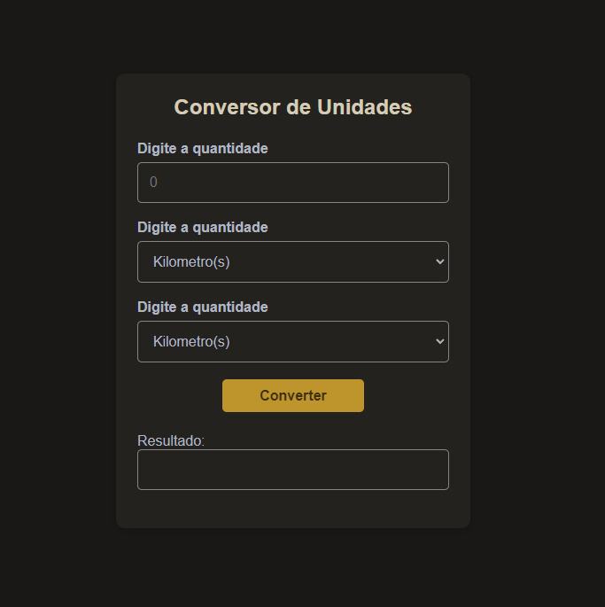

# Blog de gato / Cat blog

# Sobre o projeto / About the project

Neste projeto foi criado uma página web para conversão de unidades.

In this project, a web page was created for converting units.

## Layout
##### Desktop

# Tecnologias utilizadas / Tech stack
- HTML
- CSS
- Javascript

## Demonstração / Demo

## Autor

